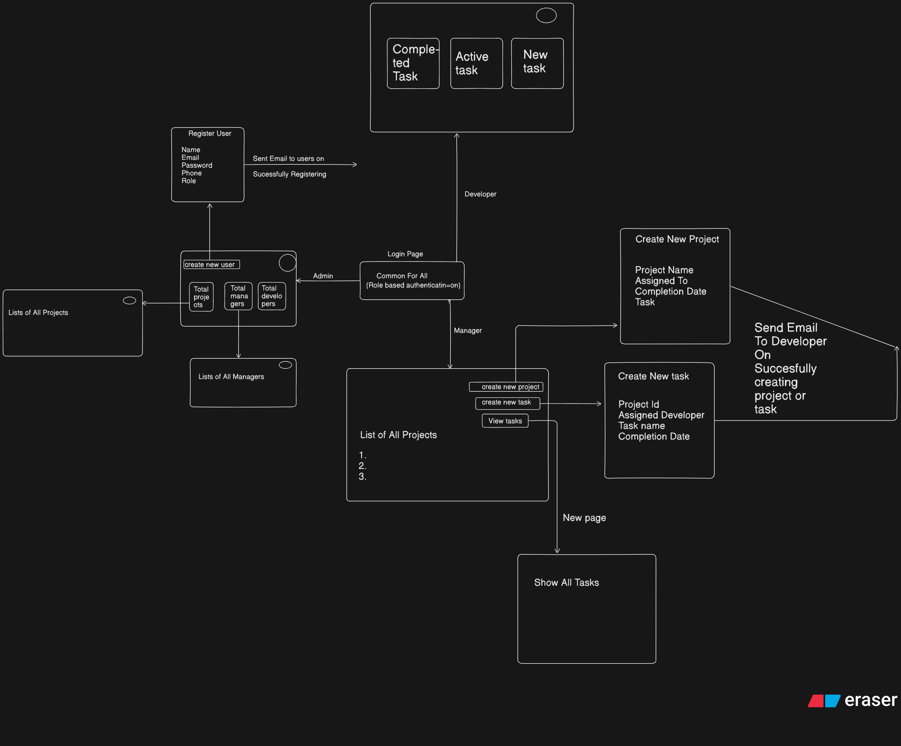

# 🧠 Project Management Backend

This backend is built for **Bespoke Technology’s Project Management System** — a robust task, project, and user management platform designed for managers, developers, and admins having role basesd authentication.  
It enables task assignment,task updation, email notifications, and smooth collaboration etc.

---

## 👤 Developer Information

**Name:** Abhimanyu Kumar  
**Email:** abhimanyukumar83097@gmail.com  
**Phone:** +91-7488957748  

---

## 🧭 System Architecture Flow (Visual Summary)

Below is the overall system flow for the project management backend:

  

## 🚀 Tech Stack

| Component | Technology |
|------------|-------------|
| **Language** | Node.js (Express.js Framework) |
| **Database** | MySQL |
| **Authentication** | JWT (JSON Web Tokens) |
| **Mail Service** | Nodemailer (with custom email templates) |
| **Environment Management** | dotenv |
| **Deployment** | Vercel |

---

## ⚙️ Installation & Setup

### 1️⃣ Clone the repository
git clone git@github.com:abhimanyu-code699/project-management-backend.git

2️⃣ Install dependencies  
npm install  

3️⃣ Setup environment variables  
PORT=5000  
JWT_SECRET=your_jwt_secret_key  
DB_HOST=localhost  
DB_USER=root  
DB_PASSWORD=yourpassword  
DB_NAME=bespoke_pm  
SMTP_USER=yourcompanyemail@gmail.com  
SMTP_PASS=yourapppassword  

4️⃣ Start the development server  
npm run dev

## 🚀 API Documentation (Postman)
You can directly view or import the full Postman collection here:

👉 [View Postman Collection](https://www.postman.com/workspace/project_management~6c1e56a1-1ffc-4942-9cd7-f49fb94bd15a/collection/31680014-466586b8-028a-4b69-bd2e-7a718b9e60e9?action=share&source=copy-link&creator=31680014)
